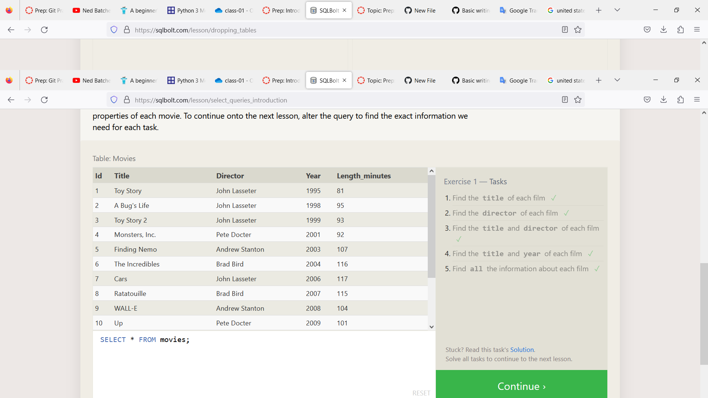

# What are the Relational databases and SQL
Relational databases are a common method of storing and organizing data,
and SQL (Structured Query Language) is a programming language used to manage and retrieve data from these databases.

